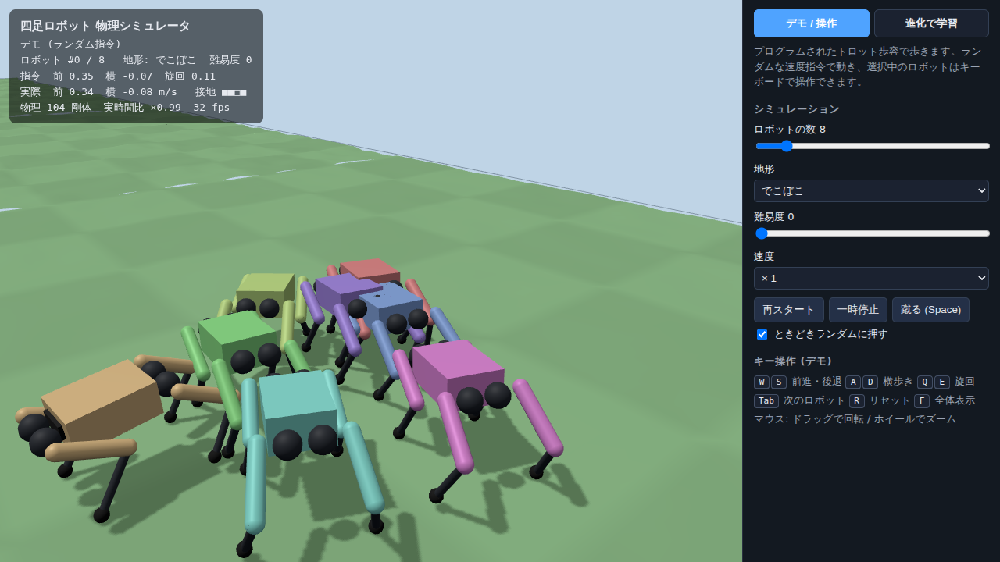
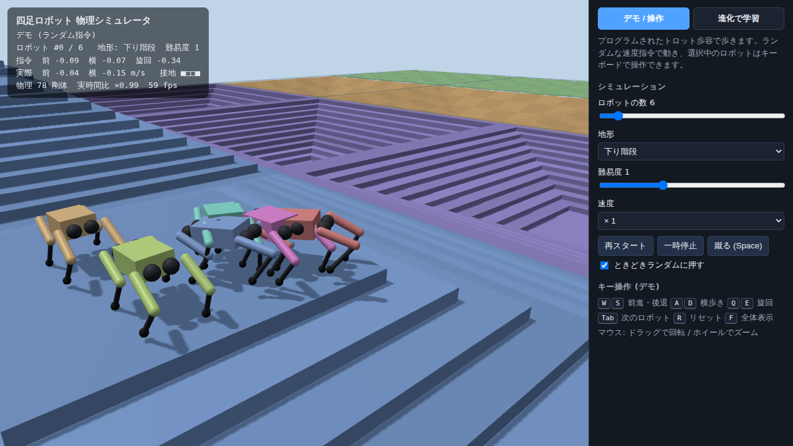
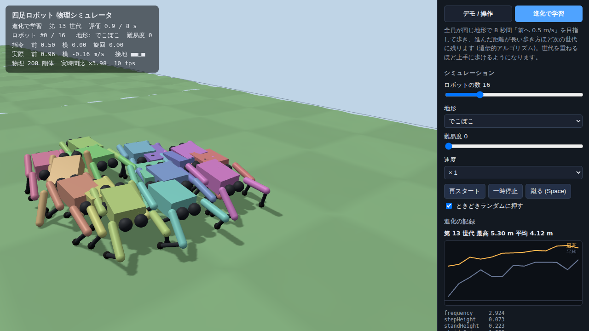
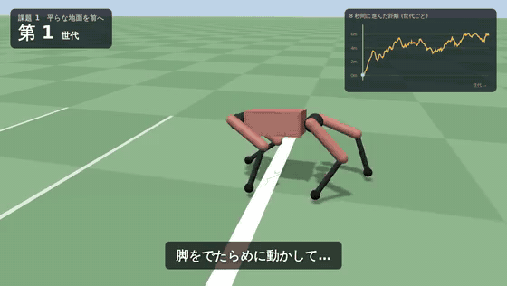

# 四足ロボット 強化学習シミュレータ (Unity + ML-Agents / Web 版)

千葉工業大学 fuRo の古田先生がデモした「絶望ロボット」
([動画](https://www.youtube.com/watch?v=g8abhEHcFA4)) のように、
**物理エンジンの仮想空間で多数のロボットを並列に動かし、強化学習で歩き方を身につけさせる**
ためのシミュレータです。まずはシンプル版です。

> 本プロジェクトは個人の学習・研究目的で独自に作成したものであり、千葉工業大学・fuRo・古田先生とは
> 関係がなく、承認を受けたものでもありません。詳しくは末尾の「著作権・ライセンス・利用規約について」を参照。

- 四足ロボット: 胴体 + 脚 4 本 × 3 関節 = 12 関節 (PhysX の ArticulationBody で PD 制御)
- 「目の見えない」ロボット: 観測は IMU (傾き・角速度) と関節角・関節速度だけ。カメラ・LiDAR なし
- 地形: でこぼこ / 坂 (上り・下り) / 階段 (上り・下り) / 段差ブロック × 難易度 6 段階
- 難易度カリキュラム: 遠くまで歩けたロボットは難しい地形へ、歩けなかったら易しい地形へ
- 外乱: ときどきランダムに押される (蹴られても倒れないように学習)
- 並列台数は設定で変更可能 (既定 16 体。fuRo のデモは 4096 体)
- 学習前でも **プログラムされたトロット歩容** で歩くので、開いてすぐ動作を確認できる
- **Web 版 (HTML / CSS / JavaScript)** もあり、ブラウザだけで動く (下記)

| Web 版: デモ | Web 版: 階段 | Web 版: 進化で学習 |
|---|---|---|
|  |  |  |

動画: [docs/media/web_demo.mp4](docs/media/web_demo.mp4) (キーボードで前進 → 旋回 → 蹴る)

## 動かし方

### 1. プロジェクトを開く

1. Unity Hub で **Unity 6 (6000.0 LTS)** をインストール
2. Unity Hub →「Add」→ このリポジトリの `RobotSimulator` フォルダを選ぶ
3. 初回はパッケージ (ML-Agents 4.0.3 など) の読み込みに数分かかります

### 2. Play する

どのシーンでも **Play を押すだけ** でシミュレーションが自動生成されます
(`SimulationBootstrap`)。シーンとして保存したい場合はメニュー
`RobotSim > Create Main Scene` を実行すると `Assets/RobotSim/Scenes/Main.unity` が作られます。
並列台数などは Hierarchy の `RobotSimulation` オブジェクト (SimulationManager) の Inspector で変更します。

| キー | 操作 |
|---|---|
| W / S | 前進 / 後退 |
| A / D | 左 / 右へ横歩き |
| Q / E | 左 / 右へ旋回 |
| M | 選択中ロボットのキーボード操作 ON/OFF (OFF だとランダムな速度指令) |
| Space | 選択中ロボットを蹴る |
| R | 選択中ロボットをリセット |
| Tab / B | 次 / 前のロボットを選択 |
| 1〜5 | 地形を変更 (でこぼこ / 上り坂 / 上り階段 / 下り階段 / 段差) |
| + / - | 難易度を上げる / 下げる |
| F | 全体表示 / 追従表示 |
| P | ランダムな外乱 ON/OFF |
| T | 4 倍速 |
| 右ドラッグ / ホイール | カメラ回転 / ズーム |

### 3. 強化学習する

```bash
# Python 3.10.12 の環境を作る (ML-Agents の要件)
conda create -n mlagents python=3.10.12 && conda activate mlagents
python -m pip install mlagents==1.1.0

# リポジトリのルートで
mlagents-learn config/quadruped_ppo.yaml --run-id=quadruped01
# 「Start training by pressing the Play button in the Unity Editor」と出たら Unity で Play
```

- 学習中は画面左上に `TRAINING` と表示されます。進み具合は `tensorboard --logdir results` で確認
- 並列台数を増やすと学習が速くなります (PC の性能次第。まずは 16〜64 体程度から)
- さらに速くしたい場合: `RobotSim > Build Training Executable` でビルドし、
  `mlagents-learn config/quadruped_ppo.yaml --run-id=q02 --env=Builds/Quadruped/Quadruped --num-envs=4 --no-graphics`
- 学習が終わると `results/quadruped01/Quadruped.onnx` ができます。これを Unity の `Assets` に入れ、
  SimulationManager の **Policy Model** に設定して Play すると、学習した方策で歩きます

## Web 版 (HTML / CSS / JavaScript)

`web/index.html` を **ブラウザで開くだけ** で動きます (インストール不要。ビルド済みの `web/dist/app.js` を同梱)。

- 物理エンジン: [Rapier](https://rapier.rs/) (Rust 製の物理エンジンの WebAssembly 版)、描画: [Three.js](https://threejs.org/)
- ロボット・地形・歩容は Unity 版と同じ設計 (歩容の計算結果が C# 版と一致することをテストで確認済み)
- **デモ / 操作** タブ: ロボットがランダムな指令で歩き回る。キーボード (W/A/S/D/Q/E) で操作、Space で蹴る
- **進化で学習** タブ: 全員が同じ地形で 8 秒間歩き、遠くまで進めた歩き方を親として次の世代を作る
  (遺伝的アルゴリズム)。世代ごとの記録がグラフで見られ、最良の歩き方をデモに使える。
  ※ ニューラルネットの強化学習 (PPO) は Unity 版 + ML-Agents で行います
- URL で初期設定を変えられます: `index.html?mode=evolve&count=32&terrain=stairsUp&level=1&speed=2`

```bash
cd web
npm install          # 開発する場合のみ
npm run build        # src/ → dist/app.js
npm test             # 物理チェック (立つ・歩く・後退・横歩き・旋回・蹴られても倒れない)
npm run evolve       # 歩容パラメータを遺伝的アルゴリズムで最適化 (ブラウザなし)
```

## 進化で歩き方を覚えるまでの動画 (Web 版)

ランダムな脳 (小さなニューラルネット) から始めて、**進化戦略**で世代を重ね、歩き方を身につけていく過程を
字幕付きの動画にしました。



**動画 v3 (約 6 分・字幕とナレーション・効果音・BGM 付き)**: [docs/media/film_v3.mp4](docs/media/film_v3.mp4)
— v2 の内容に続けて「課題 5　お手本で歩き方を自然に」の章を加えたもの。ナレーション: **VOICEVOX:ずんだもん**
(音声入りの動画は MIT License の対象外です。[音声について](#音声-voicevox-ずんだもん) を参照)

**動画 v2 (約 3 分・字幕のみ)**: [docs/media/film_v2.mp4](docs/media/film_v2.mp4)
(上の GIF は見どころだけを切り出したもの。全編はリンク先の mp4 で再生できます)

| 課題 | 世代 | 結果 |
|---|---|---|
| 1. 平らな地面を前へ | 300 | 転ぶ → 踏ん張る → はいずる → 速く走る (8 秒で約 6 m) |
| 2. きれいな姿勢で歩く | 250 | 胴体を持ち上げて歩く |
| 3. でこぼこ道 | 120 | 転ぶ割合 82% → 約 8% (ただしゆっくり) |
| 4. 壁 3 枚をよけてゴール (いきなり) | 200 | 失敗 (一度もゴールできず) |
| 4a. 曲がって目標へ | 120 | 初めてのコース 12 個中 0 → 8〜9 個で到達 |
| 4b. 壁 1 枚の向こうへ | 120 | 初めてのコース 12 個中 3 → 9 個でゴール |
| 4c. 壁 3 枚 (再挑戦) | 150 | 1 枚目は抜けるが、ゴールできたコースはなし |

| 5. お手本で歩き方を自然に (v3) | 150 | 人が決めた歩き方の「型」(ウォーク・トロット) を土台に、脳は速さの調整・向き・細かな補正を学ぶ。遅いときはウォーク (3 本以上の脚が接地 84%)、速いときはトロット (対角の脚がそろう 87%) |

表の 4a・4b は動画 v2 の時点の数字 (初めてのコース 12 個で評価)。v3 では 48 コースで評価し直した数字を使っています
(壁 1 枚: 以前の脳 17/48 → 課題 5 の脳 36/48、曲がる: 33/48 → 47/48。詳しくは [plan.md 4.5](docs/plan.md))。

学習はすべて CPU 4 コアのみ (GPU なし)、合計 1,635 世代・約 3 時間 20 分。

音声付き動画 (v3) の作り方 (VOICEVOX は各自で用意。リポジトリには含めません):

```bash
bash tools/voicevox/setup.sh /tmp/vv                                   # VOICEVOX CORE・辞書・音声モデルを取得 (利用規約に同意のうえで)
cd web && node test/export-narration.mjs v3 json > audio/v3/lines.json  # 台本からナレーション文を取り出す
/tmp/vv/venv/bin/python ../tools/voicevox/synth.py audio/v3/lines.json audio/v3/voice /tmp/vv
SCRIPT=v3 NARRATION=audio/v3/voice/durations.json node test/record-film.mjs /tmp/v3.mp4   # 映像 + 時刻表 (v3.timeline.json)
python3 ../tools/audio/mix.py /tmp/v3.timeline.json audio/v3/voice /tmp/v3.wav           # ナレーション + 効果音 + BGM
ffmpeg -i /tmp/v3.mp4 -i /tmp/v3.wav -c:v copy -c:a aac -b:a 160k -af loudnorm=I=-16 -shortest film_v3.mp4
```

- 効果音 (足音・ゴール・転倒) と BGM は `tools/audio/mix.py` の中で数式から作った自作の音です。足音はシミュレーションの接地に合わせて鳴らしています

```bash
cd web
npm run build
node train/train.mjs walk 300                      # 課題 1 (ランダムな脳から)
node train/train.mjs posture 250 walk              # 課題 2 (課題 1 の最終世代から)
SEEDS=2 node train/train.mjs rough 120 posture@225 # 課題 3 (課題 2 の第 225 世代から)
RESUME=1 ...                                       # 途中で止まった学習を再開
node test/record-film.mjs out.mp4                  # film.html を 1 コマずつ撮影して動画にする
SCRIPT=v1 node test/record-film.mjs v1.mp4         # 別の台本 (film-script.js の EXTRA_SCRIPTS)
```

- 脳: 入力 39 (傾き・角速度・関節角・関節速度・リズム・目標の方向・前方の距離センサー 5 本) → 32 → 12 関節
- 学習結果 (世代ごとの重み) は `web/checkpoints/*.json`、台本 (場面と字幕) は `web/src/film-script.js`
- `web/film.html` をブラウザで開いて「再生」を押すと、動画と同じ内容をその場で計算しながら再生します

## 計画・要件

- [docs/requirements.md](docs/requirements.md) … 要件定義 (これまでの要求と今後の要求)
- [docs/plan.md](docs/plan.md) … 次の作業計画 (自然な歩き方・音声入り動画)、WBS、規約の確認チェックリスト
- [docs/bipedal_plan.md](docs/bipedal_plan.md) … 次の計画: 類人猿の 4 足歩行から人の 2 足歩行へ (学説の整理、実験、WBS)
- [docs/bipedal_experiment2.md](docs/bipedal_experiment2.md) … 実験 1 の振り返りと実験 2 (計画・結果・考察・課題)

## 構成

```
RobotSimulator/                     Unity プロジェクト
  Assets/RobotSim/Scripts/Core/     Unity に依存しない計算 (運動学・歩容・報酬・観測・地形生成)
  Assets/RobotSim/Scripts/Runtime/  ロボット生成、ML-Agents エージェント、地形メッシュ、カメラ、HUD
  Assets/RobotSim/Scripts/Editor/   メニュー (シーン作成・学習用ビルド)
  Assets/RobotSim/Tests/EditMode/   Core のテスト (Unity の Test Runner で実行可)
config/quadruped_ppo.yaml           PPO の学習設定
tools/verify/                       Unity なしでの検証用 .NET プロジェクト
web/                                Web 版 (index.html, style.css, src/*.js, test/*.mjs)
docs/media/                         スクリーンショットと動画
```

### 報酬 (legged_gym を参考)

速度指令への追従 (前後・左右・旋回) を報酬とし、上下動・胴体の揺れ・傾き・トルク・関節加速度・
行動の急変・太ももやすねの接地にペナルティ、足の滞空時間 (大きな歩幅) にボーナス、転倒で終了。

## 検証

```bash
cd tools/verify
dotnet test CoreTests                 # Core のテスト (IK・歩容・地形・報酬・観測・カリキュラム・JS 版との一致)
dotnet build UnityCompileCheck        # Runtime スクリプトが UnityEngine API でコンパイルできるか
```

- `UnityCompileCheck` は UnityEngine 2021.3 の参照アセンブリと ML-Agents のスタブを使った確認なので、
  Unity 6 固有の分岐 (`#if UNITY_2023_3_OR_NEWER`) と Editor スクリプトは Unity 上での確認が必要です
- Unity 版の物理挙動 (PhysX) はまだ Unity 上で実際に動かしていません。歩容と PD ゲインは Web 版 (Rapier)
  で調整した値なので、Unity では Inspector の `Robot` (Kp / Kd など) を見ながら調整する可能性があります

### 歩容の調整で分かったこと (Web 版の物理で確認)

- 関節の PD 制御には追従の遅れ (数十 ms) があり、単純な軌道だと遊脚の最初に足が地面を引きずって後ろへ進んでしまう
  → 「先に足を上げてから前へ振る」軌道と、遅れを見越した位相リードで解決
- 膝が後ろ向きの脚は重さで重心が胴体中心より約 2.6 cm 後ろになる → 足の基準位置を後ろへずらす
- 既定のパラメータは遺伝的アルゴリズム (`npm run evolve`) で最適化した値
- 手作りの歩容は後退 (-0.3 m/s 超) や階段が苦手。これを強化学習で克服させるのがこのシミュレータの目的

## 著作権・ライセンス・利用規約について

著作権や各サービスの規約に違反しないよう、次の方針で作っています。

### 参考にしたもの (内容はコピーしていない)

- **fuRo のデモ動画** ([YouTube](https://www.youtube.com/watch?v=g8abhEHcFA4)) や関連報道は、
  「仮想空間で多数のロボットを学習させる」という**考え方の参考**にしただけです。
  動画・画像・音声のダウンロード、転載、切り抜きは一切していません (リンクのみ)。
  このシミュレータのロボット・地形・プログラムはすべて独自に作ったもので、fuRo のロボットの再現ではありません。
  「fuRo」「千葉工業大学」などの名称は各権利者のものです。
  動画 (`docs/media/*.mp4`) は説明なしで単体で見られることがあるため、関係があるかのような誤解を避けるよう、
  動画の中では fuRo などの名称を出していません。
- **ロボットの寸法**は、小型四足ロボットで一般的な大きさ・重さを参考にした汎用的な値です。
  特定の製品の設計データ (CAD・URDF・3D モデル等) は使っていません。
- **報酬の設計**は、論文・オープンソースとして公開されている legged_gym (ETH Zurich / NVIDIA, BSD-3-Clause)
  の考え方を参考にしましたが、コードはコピーしておらず独自に書いています。

### このリポジトリに含まれる第三者のソフトウェア

| ソフトウェア | ライセンス | 含まれ方 |
|---|---|---|
| [three.js](https://threejs.org/) | MIT | `web/dist/*.js` に同梱 (ビルド結果) |
| [Rapier](https://rapier.rs/) (`@dimforge/rapier3d-compat`) | Apache License 2.0 | `web/dist/*.js` に同梱 (ビルド結果、改変なし) |

- 同梱の条件 (著作権表示とライセンス全文を添えること) を守るため、ライセンス全文を
  [`web/THIRD_PARTY_LICENSES.txt`](web/THIRD_PARTY_LICENSES.txt) に収録し、`dist/*.js` の先頭にも表示を入れています
  (`npm run build` のたびに `node_modules` から自動生成)。
- 次のものはリポジトリには**含めておらず**、利用者が各自の環境で公式の配布元から入手します。
  - Unity エディタ・Unity のパッケージ (ML-Agents: Apache License 2.0、Inference Engine など) … Unity の
    [利用規約](https://unity.com/legal) に従って利用してください。Unity Personal には収入などの利用条件があります
  - ML-Agents の Python パッケージ `mlagents` (Apache License 2.0)
  - 開発用ツール (esbuild: MIT、playwright-core: Apache License 2.0、.NET SDK、NuGet の UnityEngine 参照アセンブリ)
- `tools/verify/UnityCompileCheck/Stubs/` は、ML-Agents の公開 API の名前と形だけを宣言した独自のスタブで、
  ML-Agents のソースコードはコピーしていません (Unity なしでコンパイル確認をするためだけのもの)。

### 画像・動画・フォント

- `docs/media/` のスクリーンショットと動画、上映ページ (`web/film.html`) で作る動画は、すべてこのシミュレータの
  画面を録画して作ったオリジナルです。他者の映像・画像・音楽は使っていません。
- フォントは同梱しておらず、閲覧する PC に入っているフォントで表示します。

### 音声 (VOICEVOX ずんだもん)

- 動画のナレーションは [VOICEVOX](https://voicevox.hiroshiba.jp/) の「ずんだもん」で作っています。**VOICEVOX:ずんだもん**
- VOICEVOX 本体・音声モデル・ONNX Runtime はリポジトリに含めていません (無断の再配布が禁止されているため)。
  `tools/voicevox/setup.sh` が公式の配布元から取得し、`tools/voicevox/synth.py` で音声を作ります
- 規約: [VOICEVOX ソフトウェア利用規約](https://voicevox.hiroshiba.jp/term/)、
  [ずんだもん 音源利用ガイドライン](https://zunko.jp/con_ongen_kiyaku.html)、音声モデル・ONNX Runtime の利用規約
  (`setup.sh` で取得した `VVM_TERMS.txt` など)
- **生成した音声ファイルと、音声入りの動画は MIT License の対象外**です。VOICEVOX の規約で、音声の利用を他者に
  許諾するときは各音声ライブラリの規約とクレジット表記を守らせる必要があるためです。
  これらを使う場合は「VOICEVOX:ずんだもん」のクレジットを表記し、上記の規約に従ってください

### このリポジトリ自体のライセンス

このリポジトリのプログラム・ドキュメント・画像・動画 (第三者のソフトウェア、および VOICEVOX で生成した音声と
音声入りの動画を除く) は **MIT License** で公開しています。全文は [`LICENSE`](LICENSE) を参照してください。

- 著作権表示とライセンス文を残せば、誰でも自由に使用・改変・再配布・商用利用できます
- 無保証です (作者は、このソフトウェアの利用によって生じたいかなる損害にも責任を負いません)
- `web/dist/*.js` に同梱している three.js (MIT) と Rapier (Apache License 2.0) は、それぞれのライセンスに従います
  ([`web/THIRD_PARTY_LICENSES.txt`](web/THIRD_PARTY_LICENSES.txt))
