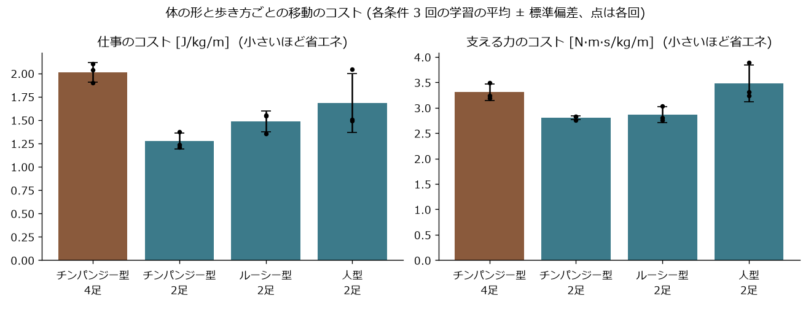

# 2 足・4 足の比較 (お手本あり、学習量をそろえ各条件 3 回)

自動で作った表です (`sim/bipedal/eval.py --summary`)。各回 16 通りの始め方 × 15 秒の平均を、さらに学習 3 回で平均しています。

| 条件 | 回数 | 仕事のコスト (J/kg/m) | 支える力のコスト (N·m·s/kg/m) | 15 秒で進んだ距離 (m) | 転んだ割合 | 両手が浮いている割合 |
|---|---|---|---|---|---|---|
| チンパンジー型 4足 | 3 | 2.01 ± 0.10 | 3.31 ± 0.16 | 11.3 ± 0.2 | 0% | 1% |
| チンパンジー型 2足 | 3 | 1.27 ± 0.09 | 2.80 ± 0.04 | 11.4 ± 0.0 | 0% | 100% |
| ルーシー型 2足 | 3 | 1.48 ± 0.11 | 2.86 ± 0.15 | 11.2 ± 0.1 | 0% | 100% |
| 人型 2足 | 3 | 1.68 ± 0.32 | 3.48 ± 0.36 | 11.0 ± 0.4 | 2% | 100% |

注意: 歩き方の型 (お手本) は人が与えている。コストは関節の力から計算した近似で、筋肉の消費エネルギーそのものではない。
