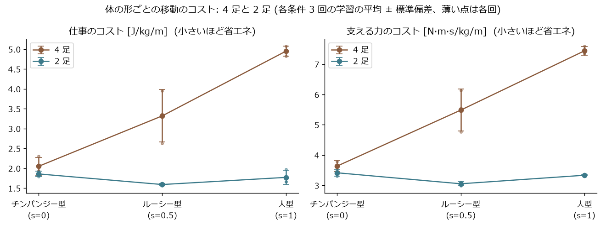

# 2 足・4 足の比較 (実験 2) (お手本あり、学習量をそろえ各条件 3 回)

自動で作った表です (`sim/bipedal/eval.py --summary`)。各回 16 通りの始め方 × 15 秒の平均を、さらに学習 3 回で平均しています。

| 条件 | 回数 | 仕事のコスト (J/kg/m) | 支える力のコスト (N·m·s/kg/m) | 15 秒で進んだ距離 (m) | 転んだ割合 | 両手が浮いている割合 |
|---|---|---|---|---|---|---|
| ルーシー型 4足 | 3 | 3.32 ± 0.66 | 5.48 ± 0.69 | 11.2 ± 0.3 | 0% | 2% |
| チンパンジー型 4足 | 3 | 2.05 ± 0.22 | 3.64 ± 0.17 | 10.4 ± 0.1 | 0% | 1% |
| 人型 4足 | 3 | 4.95 ± 0.13 | 7.44 ± 0.14 | 5.4 ± 0.5 | 100% | 7% |
| ルーシー型 2足 | 3 | 1.59 ± 0.03 | 3.05 ± 0.07 | 11.7 ± 0.0 | 0% | 100% |
| チンパンジー型 2足 | 3 | 1.86 ± 0.07 | 3.41 ± 0.10 | 10.3 ± 0.1 | 0% | 100% |
| 人型 2足 | 3 | 1.77 ± 0.18 | 3.33 ± 0.02 | 12.5 ± 0.1 | 2% | 100% |

注意: 歩き方の型 (お手本) は人が与えている。コストは関節の力から計算した近似で、筋肉の消費エネルギーそのものではない。
