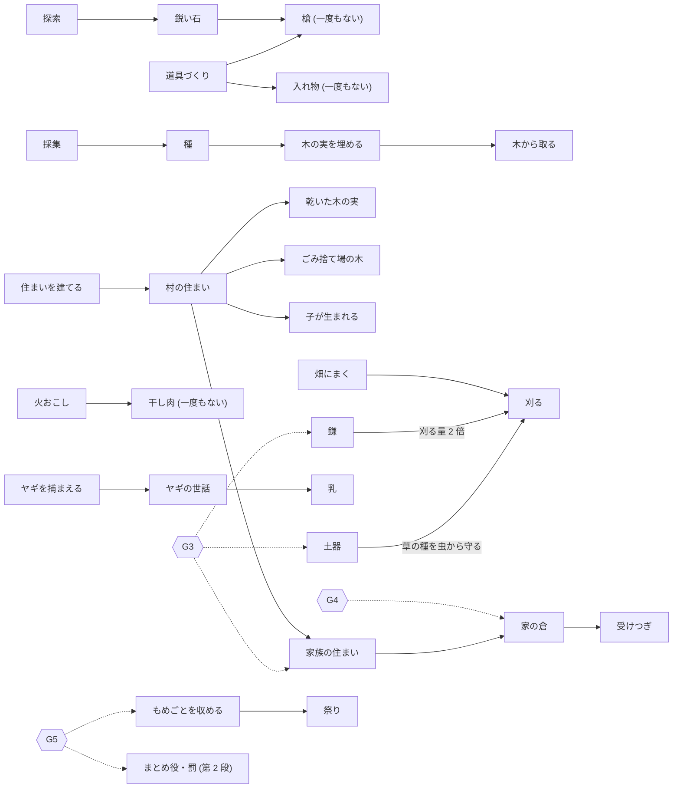

# 技術の木 (テクノロジーツリー) の作り方: たたき台

書いたのは Claude (2026-10-09)。本人「テクノロジーツリーはどのように実装できますか」。
相談のためのたたき台で、コードもシミュレーションも変えていない。

- 材料: コード (`world.py`・`era2.py`・`knowledge.py`・`characters.py`)、記録 (`state.json` を読むだけ)、調べ (`docs/research/civilization_tech_tree.md` と、今回の 2 つの調べ: 西アジアの技術の順番と年代 / 小さな村の技術の広まりと消え方の理論)
- 村の数は **16年30日目 (1949 日目)** の `state.json` で数えた (出来事 39,277 件、生きている人 26 人、うち大人 15 人)。シミュレーションはそのあとも進んでいる (書いている今は 16年60日目、1979 日目)
- 日付は「年日目」(1 年 = 120 日、最初の年は 0年)。( ) の中は通しの日。**この村の 1 年は現実の 1 年とは違う** (思いつくまでの待ち時間を縮めているため)
- 記号: 【文献】調べた資料にあること / 【仮定】この案で決めた数やきまり (本人に確かめたい) / 【議論あり】学者のあいだで意見が分かれていること
- だれが知りうるかの札は、`docs/research/historical_records.md` 5.1 と同じ: 【村】村の人がつけた記録 / 【調】あとから調べる人 (考古学者・歴史家) が分かること / 【シ】シミュレーションだから分かること
- ダッシュボードで本人と決めたこと (2026-10-09、`docs/dashboard_data_model.md` 5.):「ダッシュボードに出すのは村の人がつけた記録だけ。記録がまだない時代は、考古学の証拠 (残った跡) を今の言葉で説明して出す」。技術の木の見せ方もこれに合わせる (3.1 と問い 2)
- 調べの確かさ: 西アジアの年代と理論の調べは、ページを直接開けず、検索結果のまとめから書いた。使う前に元の論文で確かめたい

---

## 1. 技術の木とは (このプロジェクトでは)

### 1.1 ことば

| ことば | 意味 | 例 |
|---|---|---|
| 技術 | 村の人ができるようになること。4 種類: 仕事・もの・やり方・しくみ | 仕事: 土器づくり / もの: 鎌 / やり方: 干し肉 / しくみ: 家の倉 |
| 前提 | その技術の前に、なければならないもの | 家族の住まいの前に、村の住まい |
| 前提の種類 | 技術 / 材料 / 世界のようす / 人の集まり | 材料: 粘土・石 / 世界: 火が燃えている、秋 / 人: 家族がある |
| 木 | 技術を丸、前提を線でつないだ図。親が 2 つ以上あることもあるので、本当は「網の目」 | 住まい → 家族の住まい → 家の倉 |
| 開く (アンロック) | その技術が使えるようになること | G3 に入ると土器づくりが開く |
| 持っている人 | その技術を使ったことのある人 (この案で使うことば) | 土器: アル・ヨナ |

ゲーム (シヴィライゼーション) の技術の木は、ポイントをためて 1 つずつ開く。Civ VI では、関係する行動をすると早く思いつく (ブースト)。くわしくは `docs/research/civilization_tech_tree.md`。

### 1.2 この村での 2 つの意味

- **見るための木**: この村で、どの技術を、いつ、だれが最初にして、どう広まり、止まり、消えたかを、記録から描く。世界のきまりは変えない
- **できることを決める木**: 世界が「前提がそろったか」を見て、その人ができることを決める。今の「フェーズで開く」のかわりになる (か、足す)

計画の考え方「**縮めるのは思いつくまでの待ち時間**」(`docs/society2_phase_plan.md` 3.) は、できることを決める木と相性がよい。前提がそろうまでは待ち、そろったら何百年も待たせない。【文献】Ogburn & Thomas 1922 は、2 人以上が別々に思いついた発明を 148 件あげた (多くは同じ 10 年のうち)。前提がそろうと、発明はほぼ起きる。

### 1.3 今の村で、技術がどう開くか (コードを読んでわかったこと)

開き方は 5 つある。**どれも「知識による技術の木」ではない。**

1. **最初からある仕事の一覧**: Society 1.0 は `world.py:64` の 9 つ (採集・狩り・探索・休む・道具づくり・火おこし・種まき・住まいを建てる・キャンプを移す)。Society 2.0 は `era2.py:24` の `ACTS2` 11 個 (畑仕事・ヤギの世話・ヤギを捕まえるを足し、キャンプを移すを外した)。どれも最初から選べる。だから「G2 畑と家畜」の仕事は G1 から開いていた (初めてまいたのは 4年31日目、初めてヤギを捕まえたのは 4年91日目。どちらも G1)
2. **フェーズで開く** (`era2.era_at_least`, `era2.py:29`。フェーズは戻らない):
   - G3: 土器づくり (`ACTS_G3`, `era2.py:25`)。道具づくりが鎌づくりに変わる (`world.py:443`, `era2._craft`)。家族の住まい (`era2.py:483`)。虫やネズミの害・割れる
   - G4: 家の倉 (`_store_of`)、自分の家の畑から刈る、受けつぎ (`_inherit`)、若い大人の死
   - G5: もめごと・集まり・長老・祭り・よその家の倉から取る・村が分かれる。第 2 段 (`_open2`) でまとめ役・罰・呼びかけ
   - G6 は設計書 (`docs/society_phase/G6_design.md`) だけで、`era2.py` にはまだない
3. **持ち物が要る** (`world.py`): 槍には鋭い石 (`:446`)。鋭い石は探索だけで、1 日 3 割の見込み (`:427`)。昼の種まきには「種」(`:490`)。種は木の実を採ると手に入る
4. **世界のようすが要る**: 干し肉は火が燃えていて肉が残ったとき (`world.py:714`)。乾いた木の実・ごみ捨て場の木・子が生まれる・家族の住まいは、村の住まいがあるとき。乳は 1 歳以上のメスで春と夏。ヤギを捕まえるのは北の丘にいるとき。祭りは村の 3 日分の食べ物
5. **技能 (0〜1)**: うまくいく見込みを変えるだけ。やると上がり、下がらない。人から教わらない。子とよそから来た人は 0.1〜0.4 の乱数で始まる

ほかに:
- **知識 (覚えたこと) は何も開かない**。その人のお題に文として出るだけ
- 世界のきまり (FACTS) は、フェーズに入ると大人みんなに一度に伝える (`era2.py:1637-1690`)。だから最初の畑・ヤギ・家の倉の知識は、出来事をあげられず「知識の再現の疑い」のラベルになった
- Society 1.0 の F1〜F6 は何も開かなかった。新しい仕事は、走らせる合間の**コードの変更**で足した (住まいを建てる・キャンプを移す 2026-10-01、夕方の「木から取る」10-06、「木の実を埋める」10-07)

### 1.4 今のコードの木 (図)

実線 = コードの前提、点線 = フェーズで開く。

---

## 2. 今の村にある技術の一覧

- 「何人が使った」は亡くなった人もふくむ。「知っている」は、16年30日目の大人 15 人のうち、その技術にふれた知識を持っている人の数 (知識の文の言葉で数えた。【仮定】言葉で結ぶので、まちがいがありうる)。― は数えていない
- 「現実の年代と場所」は西アジアのいちばん早い年代 (調べのまとめから)。「約 N 年前」は今から数えた年、「前 N 年」は紀元前。この村の年数とはくらべられない (くらべるのは順番。4. を見る)

### 2.1 Society 1.0 から (最初の 5 人のころ)

| 技術 | 前提 (今のコード) | できるようになったこと | この村で初めての日 | だれが | 何人が使った / 知っている | 現実の年代と場所 |
|---|---|---|---|---|---|---|
| 採集 | なし (最初から) | 食べ物。木の実を採ると「種」も手に入る | 0年2日目 (1) | ルオ | 20 人 (13,246 回) / ― | 調べていない |
| 探索 | なし | 群れ・植物・魚の場所がわかる。1 日 3 割の見込みで鋭い石 | 0年2日目 (1) | セナ | 12 人 (815 回) / ― | 調べていない |
| 鋭い石 (もの) | 探索 | 槍の材料。G3 からは使い道がない (鎌に要らない) | 7年5日目 (844) | ナギ | 12 人が 244 回見つけた (ウィロ 82 個・セナ 46 個と、たまるだけ) / 2 人 | 調べていない |
| 狩り (ルク) | なし。近くに 2 頭以上の群れ。2 人以上だと見込み 2.5 倍 | 肉 | しとめた 0年30日目 (29) | イサ (ルオと) | 3 人 (しとめた 48 回。最後は 6年59日目 (778)) / 3 人 | 調べていない |
| 魚・ピク | 狩りで、近くに群れがいないとき | 小さな獲物 | ピク 0年39日目 (38)、魚 0年55日目 (54) | ルオ | 2 人 (ピク 59・魚 56) / ― | 調べていない |
| 槍 | 道具づくり + 鋭い石 (G2 まで) | 狩りが当たりやすい | 一度もない | ― | 0 / 0 | 調べていない |
| 入れ物 | 道具づくり、鋭い石も入れ物も持っていない (G2 まで) | 手もちの木の実・芋が 2 倍もつ | 一度もない | ― | 0 / 0 | 調べていない |
| 火おこし | なし (1 回の見込み 0.08 + 0.4 × 火の技能) | 3 日燃える。夜のザガ 0.2 倍。残った肉が干し肉に | 試した 6年61日目 (780)、ついた 6年62日目 (781) | ウィロ | 1 人 (ついた 30 回・つかなかった 30 回。最後は 10年90日目 (1289)) / 0 人 | 火の跡: ゲシャー・ベノット・ヤアコブ (イスラエル) 約 79万〜78万年前。いつも使う: ケセム洞窟 42万〜20万年前【文献】 |
| 干し肉 | 火が燃えている + 残った肉 (夕方に自動) | 肉が長くもつ | 一度もない | ― | 0 / 3 人 (知識が 1,082 回足された。最初は 0年56日目 (55) ルオ「塩漬けや燻製」) | 調べていない |
| 蓄える | なし (Society 2.0 では自動) | 食べ物をキャンプにためる | 0年7日目 (6) | ルオ | 5 人 (入れた 2,351 回) / 11 人 | 穀物の倉: ドゥラー (ヨルダン) 約 11,300 年前。ナトゥーフの穴は使い道がはっきりしない【文献】 |
| 村の住まい | 仕事「住まいを建てる」(2026-10-01 にコードで足した) | 雨よけ・よく休める・夜の危険 0.4 倍。乾いた木の実・ごみ捨て場の木・子が生まれる・家族の住まいの前提 | 建て始め 1年32日目 (151)、できた 1年34日目 (153) | ウィロが始め、セナがしあげた | 2 人 / 6 人 | 丸い半地下の石の家: アイン・マラッハ 約 14,300 年前 (畑のない採集民の村)【文献】 |
| 乾いた木の実 | 村の住まい (夜に自動) | 蓄えの木の実が 60 日もつ | 1年34日目 (153) から (出来事は残らない) | ― | ― / 0 人 | 調べていない |
| 木の実を埋める (種まき) | 昼は「種」を持つ。夕方・季節は手もちか蓄えの木の実 (2026-10-07 に足した) | 20 日で木が育つ | 0年9日目 (8)。木が育った 0年29日目 (28) | ルオ | 19 人 (354 回) / 10 人 | 調べていない |
| ごみ捨て場の木 | 村の住まい + 食べた木の実 (自動。2026-10-06 に本人の希望で足した) | キャンプのそばに木 (711 本) | 2年46日目 (285) | ― | ― | 調べていない |
| 木から取る | 種から育った木がキャンプのそばにあり、夏か秋 (2026-10-06 に足した) | 遠くへ行かずに木の実 | 2年45日目 (284) | セナ | 18 人 (7,528 回) / ― | 調べていない |
| 掟と集まり | なし (Society 1.0 は 7 日ごと、2.0 は季節ごと) | 半分をこえる賛成で掟が決まる | 0年8日目 (7) | 5 人の集まり | 提案した 13 人。採用中 125 本 (罰のある掟 0) / ― | 調べていない |
| キャンプを移す | Society 1.0 だけ。大人の半分をこえる人が同じ場所を選ぶ | (住まいと火を置いていく) | 一度もない | ― | 0 / 0 | ― |

### 2.2 Society 2.0 から (村。4年10日目 (489) から)

| 技術 | 前提 (今のコード) | できるようになったこと | この村で初めての日 | だれが | 何人が使った / 知っている | 現実の年代と場所 |
|---|---|---|---|---|---|---|
| 畑 (草の種をまく) と刈る | G1 から。村の蓄えの草の種。秋だけ実る | 夏のはじめに、まいた量の 3〜15 倍 | まいた 4年31日目 (510)、刈った 5年1日目 (600) | まいたのはセナとウィロ、刈ったのはセナ | まいた 15 人 (102 枚)・刈った 16 人 / 11 人 | 野生の麦を育てる: 約 11,600〜10,700 年前。栽培型の麦がレバント南・中部で 3 割: 約 10,700〜10,200 年前。オハロー II (約 2.3 万年前) の小さな試しは一つの読み【議論あり】 |
| 畑仕事 | G1 から | 手入れで実りが増える | 4年61日目 (540) | ウィロ | 13 人 (1,558 回) / (畑と同じ) | (畑と同じ) |
| ヤギを捕まえる | G1 から。北の丘にいる。1 日 0.03 + 0.04 × 狩りの技能 | 子ヤギを連れ帰る | 4年91日目 (570) | ウィロ | 試した 4 人・捕まえた 12 頭 / 11 人 (ヤギの知識) | 約 10,500〜10,000 年前。ガンジ・ダレ (イラン) 約 10,000 年前。アシュクル・ホユック (トルコ) で約 10,400 年前から 1,000 年ほどかけて (子を捕まえる → 少し産ませる → 大きな群れ)【文献】 |
| ヤギの世話・乳 | G1 から。世話が 1 季節 5 日より少ないと逃げることがある。乳は 1 歳以上のメス、春と夏 | 乳 (1 頭 1 日 3 杯) | 12年91日目 (1530)。それまでだれも世話をせず、ヤギは 10 回逃げた | ウィロ | 世話 5 人・乳 3 人 / 乳の知識 0 人 | ヒツジの乳: 前 8000〜7000 年ごろ (骨の年齢の割合から)。土器の中の乳の脂: 前 7000〜6000 年ごろ、多くはアナトリア北西部。Sherratt 1981 はもっと遅い (前 4000 年ごろから) とした【議論あり】 |
| 土器 | G3 から (フェーズで開く)。火・粘土・技能の条件はない | 土器 1 個で草の種 500 つかみを虫から守る | 形 13年31日目 (1590)、焼き上げ 13年32日目 (1591) | アルとヨナ (焼き上げはアル) | 2 人 (どちらもアルの家。724 個、割れた 154) / 6 人 | 西アジア: テル・セケル・アル・アヘイマル (シリア北東) 前 6900〜6600 年ごろ。畑から約 2,500 年あと。東アジアは先: 仙人洞 (中国) 2万〜1.9万年前、大平山元 I (青森) 約 1.5 万年前。どちらも移動する採集民【文献】 |
| 石の鎌 | G3 から (道具づくりが鎌に変わる)。鋭い石は要らない | 刈る量が 2 倍 (村の鎌の数の人まで) | 作り始め 13年1日目 (1560)、1 本目 13年3日目 (1562) | ナギとソル | 2 人 (39 本、割れた 16。13年30日目 (1589) からは作っていない) / 1 人 | 刃: オハロー II (ガリラヤ湖のほとり) 約 2.3 万年前。柄つきの鎌: ナトゥーフ 約 15,000〜11,700 年前【文献】 |
| 家族の住まい | G3 から + 村の住まい + 家族。のべ 400 時間で 20 m² | 家族の家。村の住まい (12 人まで) からあふれずにすむ | 建て始め 13年31日目 (1590)、できた 13年66日目 (1625) | フウ (フウの家) | 10 人 (6 軒) / ― | 四角い何部屋もの家が広がる: 前 8800〜6900 年ごろ (PPNB。Flannery)。その前 (PPNA) は丸い家と四角い家が同じ層に【文献】 |
| 家の倉 | G4 から + 家族の住まい + 代表の答え keep | 家の畑の草の種を家の倉に | 14年30日目 (1709) (G4 の F1) | 家の代表 | 9 家族のうち 6 家族 / 4 人 | 家ごとの倉: 前 8800〜6900 年ごろ (PPNB)。その前は共同の建物 (ジェルフ・エル・アハマルなど)【文献】 |
| 受けつぎ | G4 から + 家の長が亡くなり、家に倉・畑・ヤギがある | 家の持ち物が家に残る | 13年120日目 (1679) | ソル (ナギの家の畑 2 枚) | 2 回 (ソル・ネム) / 知識 2 回足された | 調べていない |
| もめごとを収める | G5 から | 集まりか長老が収める | 14年60日目 (1739) | 集まり | 3 件 (長老が収めたのは 0) / 知識 16 回足された | 調べていない (計画は Johnson 1982 の考え) |
| 祭り | G5 から + 半分をこえる人 + 村の 3 日分 | 収まっていないもめごとの半分が収まる | 15年30日目 (1829) | 集まり | 2 回 / 5 人 | ヒラゾン・タクティトの祭り 約 1.2 万年前 (計画の文献。`society2_phase_plan.md` 5.) |
| まとめ役・罰 (G5 第 2 段) | 第 2 段が開いた 15年60日目 (1859) | まとめ役を選ぶ・罰のある掟・呼びかけ | まだない (16年1日目の選びは「なし」14、セナ 2) | ― | 0 / まとめ役 3 回・罰 2 回足された | 計画ではウバイド期 (Stein 1994)。年代は調べていない |
| 受け入れ・家族の代表 | 半分をこえる賛成 / 大人が 12 人をこえる | よそから人が加わる / 代表が答える | 受け入れ 5年30日目 (629)、代表 10年60日目 (1259) | ナギとソルが加わった | 9 組が来て 8 組を受け入れた | 調べていない |

### 2.3 計画だけ (G6。コードはない)

| 技術 | 前提 (設計書) | できるようになること | この村で初めての日 | だれが | 何人が使った / 知っている | 現実の年代と場所 |
|---|---|---|---|---|---|---|
| 交換・印と封・数え札・封筒・粘土の板 | 困りごとが起きてから使える (`G6_design.md`)。印は G6 のはじめ → 数え札は、印で封をし、記録のない量を覚えで決めたあと → 封筒は、ほかの村との貸し借りがあるとき → 粘土の板は、数え札の季節が 4 つ以上で、1 季節に 200 個以上要ったあと | ほかの村との交換、量を残す・確かめる | まだない | ― | 0 / 0 | 数え札 (トークン): 前 9000 年ごろ (ムレイベト・アシアブ)、前 7500 年ごろ広がる。印: 前 7000 年ごろの少し前〜前 6000 年ごろ (前 8 千年紀の終わり〜前 7 千年紀。ラス・シャムラ・ビブロス・ブクラス、チャタルヒュユクの粘土の印)。サビ・アビヤド (前 6000 年ごろ) で封と数え札が一緒に。封筒: 前 3500 年ごろ。数だけの板: 前 3500〜3350 年。原楔形文字: 前 3350〜3200 年 (ウルク IV)【文献】。初めのころの数え札が数える道具だったかは【議論あり】 |

### 2.4 一覧からわかること

- **知っているのに、していない**: 干し肉は 4 人が話題にし、知識が 1,082 回足された (伝承 971)。でも干した日は一度もない。「知っている」と「使った」は分けて記録しないといけない
- **フェーズでみんなに一度に開いたが、したのは 1 家族だけ**: 土器は G3 で大人みんなに開いたが、作ったのはアルの家の 2 人だけ
- **一度もないもの**: 槍・入れ物・干し肉・キャンプを移す (槍と入れ物は、`data_archive` の 7 回の試しにもない)
- **コードと史実のずれ**:
  - 土器に火が要らない。お題 (FACTS_G3、`era2.py:1642`) では「火で焼く」と伝えている。火をおこしたのはウィロだけで、土器を作った 2 人は一度も火をおこしていない
  - 鎌に石の刃 (鋭い石) が要らない。鋭い石はたまるだけ
  - 火をおこせるのはウィロ 1 人 (火の技能 1.0)。史実では、火は村よりはるか前からある (4.)
- **技能のまとまりが大きい**: 「道具」の技能は、鎌を作っても住まいを建てても上がる (`world.py:489`, `era2.py:495`)。だから 16年60日目に 道具 1.0 の大人は 7 人いるが、鎌を作ったことがあるのはソルだけ。技術ごとに「持っている人」を見るなら、技能を技術ごとに分けるか、出来事で見る
- **なくなることがあるか**: できること (仕事の一覧) はなくならない (一覧は増えるだけで、フェーズは戻らない)。減る・消えるのは:
  - 村にある数: 鎌は 39 本作って 16 本割れ、23 本 (1 季節 5% 割れる)。土器は 724 個作って 154 個割れ、570 個 (1 季節 3%)
  - 人の技能: 亡くなると一緒に消える。鎌を作ったナギは 13年120日目 (1679) に亡くなった
  - ヤギ (世話が少ないと逃げる。10 回)、火 (3 日で消える)、知識 (多すぎると消える)
  - 「知っている人がいないからできない」ことはない。だれでも試せる (技能が低いので見込みは下がる)
- **知識の記録の限り**: 知識は 1 人 30 個までで、多すぎると確信度の低いものから消える。このとき `knowledge_log` に書かない (`knowledge.py:77-82`)。だから「いつ、だれが知っていたか」は `knowledge_log` だけでは組み立てられない。ただし `state.json` は季節ごとに git に残っている (755 回のコミット) ので、過去の季節の state.json を読めば組み立てられる

---

## 3. 作り方の案

### 3.0 どの案でも使う表

ダッシュボードの表 (`docs/dashboard_data_model.md` の ①〜⑧、`docs/research/historical_records.md` の ⑨〜⑪) とまぎれないように、技術の表は「技1〜技5」と呼ぶ。
記号は同じ: ○ もう記録にある / △ 今の記録から組み立てられる (過去の分も作れる) / × 記録にない (これから残す)。
各表の終わりに、列ごとの「だれが知りうるか」(【村】【調】【シ】) を書いた。ダッシュボードに出せるのは【村】と【調】、【シ】は今のアプリの欄 (出来事と会話・人のカード) に出す、という本人の決めごとに合わせるため。

#### 技1 技術 (1 行 = 1 つの技術。手で書く。30 行ほど)

| 列 | 例 (土器) | 今 |
|---|---|---|
| id・名前 | pot・土器 | × (書く) |
| 種類 | 仕事 (ほかに: もの・やり方・しくみ) | × |
| やさしい説明 | 川の粘土をこねて形を作り、乾かして焼く。草の種を虫から守る | × |
| 村での見分け方 (出来事) | 出来事「土器」で data.count が 1 以上 (= 焼き上げた) | × (書く。出来事は ○) |
| 村での見分け方 (知識の言葉) | 「土器」「粘土」【仮定】 | × |
| 今のコードでの開き方 | G3 (フェーズ) | × |
| 現実のいちばん早い年代・場所 | 前 6900〜6600 年ごろ、テル・セケル・アル・アヘイマル | × |
| 出典と確かさ | Nishiaki & Le Mière 2005【文献】 | × |
| 地域の違い | 東アジアは採集民が先に作った (大平山元 I 約 1.5 万年前) | × |

#### 技2 前提 (1 行 = 1 本の線)

| 列 | 例 | 今 |
|---|---|---|
| 後の技術 | 土器 | × |
| 前のもの | 火おこし | × |
| 前のものの種類 | 技術 / 材料 / 世界のようす / 人の集まり | × |
| まとまり番号 | 同じ番号の中は「どれか 1 つでよい」(OR)、番号どうしは「全部要る」(AND) | × |
| 強さ | 要る / 助けになる (例: 定住は土器の「助け」。東アジアの採集民は定住せずに作った) | × |
| コードにあるか | ○ コードの条件 / 史実だけ (今のコードにはない) | × |
| 出典 | 【文献】か【仮定】 | × |

#### 技3 人 × 技術 (1 行 = 1 人と 1 つの技術)

| 列 | 例 (ヨナと土器) | 今 |
|---|---|---|
| 使った: 初めての日・回数・最後の日 | 13年31日目・239 回・15年60日目 | △ (出来事から) |
| 知っている: 知識の id・覚えた日・ラベル (創発 / 伝承 / 知識の再現の疑い)・だれから | (知識の言葉で結ぶ) | △ (state.json と git の過去の state.json から) |
| 技能 (0〜1) | 土器 1.0 | × (今の値だけ。季節ごとに残す) |
| 教わった: だれから・いつ | (案 B・C から) | × |

#### 技4 村 × 技術 × 季節 (1 行 = 1 つの技術の 1 季節)

| 列 | 例 (土器、16年の夏) | 今 |
|---|---|---|
| 状態 | 使った (下の 3.1) | △ |
| 止まっているか | いいえ | △ |
| 知っている大人の数 | 6 人 | △ |
| 使ったことのある、生きている人と家族の数 | 2 人・1 家族 | △ |
| この季節に使った人・回数 | ― | △ |
| 村にある数 | 土器 570 個 (鎌なら 23 本、ヤギなら 23 頭) | △ (出来事の文の「村の土器 N 個」から) |
| 新しく知った人・忘れた人・亡くなった持ち主 | ― | △ (忘れた人は、多すぎて消えた分は × ) |

#### 技5 技術の出来事 (1 行 = 1 回)

| 列 | 例 | 今 |
|---|---|---|
| 日・技術・種類 | 13年32日目・土器・初めて使った (ほかに: 初めて知った / 広まった / 止まった / 忘れられた / また見つかった / 教えた) | △ |
| だれ・もとの出来事の番号 | アル・(番号) | ○ |

`resume.py` の「初めて…」の行 (今は採集・狩り・探索・蓄える・種まき・住まい・ルクの初めての獲物・初めての掟だけ) も、技5 から作れるようになる。

---

### 3.1 案 A 見るための木 (シミュレーションは変えない)

**何をするか**: 記録 (出来事・知識・技能・村の数) から 技3〜技5 を組み立て、技1・技2 の木の上に描く。まだの技術は灰色、史実の年代を横に並べる。

**状態** (5 つ。【仮定】決め方は本人に決めてほしい。6. の問い 2)

| 状態 | 決め方 (案) |
|---|---|
| 未発見 | だれも使ったことがなく、知識もない |
| 知っている | 知識を持つ人はいるが、だれも使ったことがない |
| 使った | 使ったことのある生きている人が、1 つの家族にだけいる |
| 広まった | 使ったことのある生きている人が、2 つ以上の家族にいる (家族ができる前の Society 1.0 は 3 人以上) |
| 忘れられた | 使ったことのある人が、生きている村の人にいない。知識だけ残っていれば「忘れられた (話だけ残る)」 |

ほかに印として「**止まっている**」= 使ったことはあるが、この 1 年 (4 季節) だれも使っていない。

**今の記録に当てはめると** (16年30日目。生きている人で数えた)

| 技術 | 状態 | わけ |
|---|---|---|
| 採集・木の実を埋める・木から取る | 広まった | 生きている 15 人、8 家族 |
| 畑・刈る・畑仕事 | 広まった | 生きている 12・13・11 人、6〜7 家族 |
| 探索 | 広まった | 生きている 9 人、4 家族 |
| ヤギの世話 | 広まった | 5 人、3 家族 (川辺の家・アルの家・ケトの家) |
| 乳 | 広まった | 3 人、2 家族 (川辺の家・ケトの家) |
| ヤギを捕まえる | 使った | 生きているのはウィロとタヒ (どちらも川辺の家)。ほかの家のナギとカイは亡くなった |
| 土器 | 使った | アルとヨナ (アルの家だけ)。最後は 15年60日目 (1859) |
| 村の住まい | 使った・止まっている | ウィロとセナ |
| 狩り (ルクをしとめる) | 使った・止まっている | ウィロだけ。最後は 6年59日目 (778) |
| 火おこし | 使った・止まっている | ウィロだけ。最後に火がついたのは 10年90日目 (1289) |
| 鎌 | 使った・止まっている | 生きているのはソルだけ (ナギは 13年120日目に亡くなった)。最後は 13年30日目 (1589) |
| 干し肉 | 知っている | 一度もない。知識を持つ大人 3 人 |
| 槍・入れ物・キャンプを移す | 未発見 | コードにはあるが、一度もなく、知識もない |
| 忘れられた | (まだない) | 今のコードでは消えないので、出るのは持っている人がみな亡くなったときだけ |

ここから見えること: ウィロ 1 人が、火・ルク狩り・ヤギを捕まえるの 3 つを持っている。土器は 1 家族、鎌は 1 人。

**コードのどこ**:
- 新しいファイル `sim/society/tech_nodes.json` (技1・技2。手で書く。出典つき)
- 新しいプログラム `sim/society/tools/tech_tree.py` (`tools/progress_chart.py` のように、読むだけ): `state.json` と git の過去の `state.json` を読み、技3〜技5 を書き出す。出来事との結び方の例: 土器は data.count が 1 以上 / 鎌は出来事「道具」で「鎌を」/ 火は「できなかった」でないもの / ルクは「しとめた」
- ダッシュボードの 1 画面 (形はダッシュボードの相談で決める)
- (次の部の区切りで、記録だけ足すとよいもの。世界の動きは変わらない) `era2._season_end` (`era2.py:1172`) で 技4 の 1 行と技能を季節ごとに残す / `knowledge.apply_updates` (`knowledge.py:43`) で、多すぎて消えた知識も `knowledge_log` に「忘れる (多すぎ)」と残す

**手間**: 小〜中。技術の表 30 行ほど (出典つき) を書く + 読み出しのプログラム 1 本 + 画面 1 枚。走らせている間も作れる (読むだけ)。

**G6 とそのあとへの影響**: G6 の交換・印・数え札・封筒・粘土の板・町を 技1 に足すだけ。G6 の設計は使えるようになった日 (`open`) と出来事「記録」を残すので、そこから読める。G6 の作り方は変えない。

| 良い点 | 悪い点 |
|---|---|
| 今の走りに何も起きない。今すぐ作れる | 描くだけで、世界は変わらない。「フェーズで全員に一度に開く」こともそのまま描く |
| 「知っているのにしていない」(干し肉) や「1 家族だけの技術」(土器) が見える | 今のコードでは技術は消えないので、「忘れられた」はほとんど出ない |
| 史実の年代と順番を横に並べられる | 知識と技術を言葉で結ぶので、まちがいがある【仮定】。表を本人が見て直せるようにする |

---

### 3.2 案 B できることを決める木 (フェーズの関門をやめる)

**何をするか**: 「G3 に入ると土器をみんなに開く」をやめて、技術ごとに次の順で進める。

1. **前提が世界にそろう** (技2。材料・前の技術・世界のようす・人の集まり)
2. **きっかけの出来事** が世界で起きる。【仮定】例: 「火のそばに置いた粘土が固くなった」。その場にいた人のお題にだけ出る。知識にその出来事をあげれば「創発」になる (今のラベルの決め方のまま)
3. その人が**試す** (仕事として選ぶ)。できたら「使った」
4. **広まる**: 話すと知識だけが伝わる。一緒に働く (答えの「一緒に行きたい人」`with` を使える) か教わると、技能も伝わる。写すと少し下手になる【仮定】。だれから学ぶかは村の人 (Claude) が選ぶので、「上手な人をまねる」「みんなと同じにする」が起きるかを、決めつけずに見られる (Boyd & Richerson 1985、Henrich & Gil-White 2001【文献】)
5. **なくなる**: 持っている人がみな亡くなる・村を出る、または X 年だれも使わない【仮定】と、その技術は仕事の一覧から消える。また見つけるには、きっかけをもう一度か、よその村から (G6)

- お題には、その人が知っている技術だけを仕事として出す。**木全体は見せない** (ゲームのメニューのようになり、外の知識を呼びやすい)
- 前提のない技術を言い出しても、世界では起きない。その知識は「知識の再現の疑い」のまま残る
- フェーズ (G) の条件は 技4 を読む (例: G3 の「作る人」)。木が先で、フェーズはあと

**シミュレーションで変わるところ (コードのどこ)**:
- `era2.acts2` (`era2.py:34`) を人ごとに (`acts2(state, p)`)。使っているところ: 答えを読む `apply_answers` (`era2.py:159`)、まとめ役の呼びかけ (`:935`)、お題の仕事の一覧 (`:1808`)
- お題のきまり FACTS (`era2.py:1790`): フェーズに入ると全員に出すのをやめ、きっかけを見た人と持っている人に
- `world.py` の `ACTS2_EXTRA` (`:292`) と `simulate_day` (`:305`, `:369`)
- `era2._craft` (`:403`): 土器は火があるとき、鎌は石の刃を使う (史実に合わせるなら)
- `era2._season_end` (`:1172`): 技4 の行、広まる・なくなる
- `knowledge.apply_updates` (`knowledge.py:43`): 知識に技術の id をつける
- `era2.check`・`indicators` (`:1530`, `:1411`): 条件を 技4 から読む
- `era2._new_person` (`:81`): 子は親や家の人から教わる道 (今は親と関係のない乱数)
- Society 1.0 の仕事 (`world.py:64`) も同じ形にするなら、`characters.py` のお題も

**今までの結果へのおそれ**:
- 過去は別のきまりで動いた (G1 で畑とヤギがみんなに開いた。G3 で土器がみんなに開いた)。B を最初からとすると過去の記録と合わない。走り直さず、「この日から仕組みが変わった」と書き残して、先だけに使うことになる
- 進みが遅くなる・止まるおそれ (だれもきっかけに気づかない)。「縮めるのは思いつくまでの待ち時間」と逆になりうる
- 【仮定】の数が多い (きっかけの見込み、写すときの下手さ、忘れる年数)
- G5 第 2 段など、今の条件の届きやすさが変わる
- 大人 15 人の村では、1〜2 人の死で技術がなくなる。史実には近いが、話の進みが大きく揺れる

**史実に合わせるには**: 技1・技2 を【文献】から作る (例: 土器 = 粘土 かつ 火。定住は「助け」)。同じ技術に何本も道 (OR) を作る。年代の列を並べる。なくなる・また見つかるを入れる。人の数で技術が決まる式 (Henrich 2004) は【議論あり】(Vaesen ほか 2016) なので、そのまま入れない。入れるなら【仮定】として数を見せる。

**手間**: 大。上のコードの多くの場所を変え、写しで何度も試す。

**G6 とそのあとへの影響**: G6 の記録の道具 (困りごとが起きてから使える) は B と同じ考えなので、B の一部として作り直す。G6 を作るのは B ができてからになる。よその村は、技術が来る道にもなる (極北のイヌイット: 1859 年に出発したバフィン島からの人々が、1860 年代にカヤック・弓・やすをもう一度伝えた【文献】)。

| 良い点 | 悪い点 |
|---|---|
| 理論 (前提がそろうと思いつく、持っている人、なくなる) にいちばん合う | 走っている途中で世界のきまりが大きく変わり、今までとくらべにくい |
| できるかどうかを世界が決めるので、Claude の外の知識がもれにくい | 【仮定】の数が多く、調整に時間がかかる |
| 「だれが見つけ、だれに教えたか」が物語になる | 遅すぎる・止まるおそれ |
| なくなる・また見つかるが自然に起きる | 手間が大きく、G6 が遅れる |

---

### 3.3 案 C その間 (フェーズは大きな枠のまま、中で木が決める)

**何をするか**: フェーズ (章・動画・条件) はそのまま。フェーズで開くことの意味を「みんなに開く」から「**思いついてもよい**」に変える。

1. フェーズがゆるし、前提が世界にそろうと、きっかけの出来事 (B と同じ) が起きる
2. 試した人・教わった人だけが、その仕事を選べる
3. 持っている人がいなくなると止まる (もう一度きっかけを待つか、よその村から)
4. ダッシュボードには案 A の木を出す (C の状態をそのまま描く)

- どの技術に当てはめるかは本人に決めてほしい (6. の問い 3): G6 の新しい技術だけ / 作る技術 (土器・鎌) も / すべて
- 今ある技術の「持っている人」は、記録から決める (技3: 使ったことのある人)。例: 土器はアルとヨナ、鎌はソル

**シミュレーションで変わるところ (コードのどこ)**: B より少ない。
- `era2.acts2` を人ごとに (当てはめる技術だけ)、`apply_answers` (`:159`)、お題の仕事の一覧 (`:1808`)
- `era2._craft` (`:403`)、`era2._season_end` (`:1172`)
- 教わる: 新しい仕事を足さず、今の答えの「一緒に行きたい人」(`with`) で、持っている人と同じ仕事を 1 季節すると覚える【仮定】。家族の代表が家の人の仕事を割り振る (`family`) ので、家の中で教えることも起きうる
- FACTS_G3 などは、フェーズに入ったときに全員に出すのでなく、きっかけを見た人と持っている人に

**今までの結果へのおそれ**: B より小さい。フェーズとその条件はそのまま。ただし当てはめた技術は、区切りから先は「持っている人とその弟子だけ」になる。土器なら今と同じ (作っているのはアルの家だけ) だが、アルの家が亡くなったり村を出たり (G5 では家が分かれることがある) すると、村から土器づくりがなくなりうる。

**史実に合わせるには**: B と同じ (技1・技2 を【文献】から、OR の道、年代の列、なくなる)。村が分かれたら、どちらの村にどの技術が残ったかを記録する (【文献】Derex & Boyd 2016: 6 人を 3 組の 2 人に分けたほうが、全員がつながった組より、いちばん難しい答えにたどりつくことが多かった)。

**手間**: 中。

**G6 とそのあとへの影響**: 入れるならいちばん安い時。G6 の設計はもう「困りごとが起きてから使える」(フェーズの中で開く) なので、C の形になっている。足すのは「記録をつける人 (数え札・板を使える人) の持っている人・教わる・なくなる」だけ (設計書の state に 1 項目)。【文献】原エラム文字 (前 3200/3100〜2900 年ごろ) は使われなくなり、今も読めない。記録の技術もなくなりうる。

| 良い点 | 悪い点 |
|---|---|
| フェーズ・動画・条件はそのまま。今までとくらべられる | フェーズの「枠」は残るので、一本道の形は少し残る |
| 少ない人の技術はなくなりうる (理論でいちばん支持のある点) が出る | 当てはめた技術は、持っている人が亡くなると止まる。話の進みが揺れる |
| G6 を作るのと一緒にできる | 教わる・なくなるの数は【仮定】 |
| B への足場になる (次の周回で広げられる) | 当てはめない技術との 2 通りのきまりが混ざる |

### 3.4 3 つの案のくらべ

| | A 見るための木 | C その間 | B できることを決める木 |
|---|---|---|---|
| シミュレーションを変えるか | 変えない (記録だけ足すのは区切りで) | 一部の技術だけ | 全部の技術 |
| 今の走りへの影響 | なし | 小〜中 (区切りから先) | 大 |
| 手間 | 小〜中 | 中 | 大 |
| 史実に近いか (なくなる・何本もの道) | 描くだけ | 当てはめた技術で近い | いちばん近い |
| G6 | 表に足すだけ | G6 と一緒に作れる | G6 を作り直す・遅れる |

---

## 4. 史実との合わせ方

### 4.1 一本道ではない

- **地域で順番が違う**: 日本では土器 (大平山元 I、約 1.5 万年前) が先で、田んぼの米づくりは約 2,400 年前。西アジアでは畑が先で、土器は前 6900 年ごろ【文献】。だから 1 本の決まった順にせず、「どれか 1 つでよい」前提 (OR) を使う。例: 土器 = 粘土 かつ 火 (定住は「助け」で、要るものではない)
- **同じ技術が何か所でも生まれた**: ヤギを飼うのはイランのガンジ・ダレとトルコのアシュクル・ホユックなど何か所でも。速いろくろは北メソポタミアと南レバントで別々に (Baldi & Roux 2016)。金属を溶かすのも何か所か【文献】
- **「新石器時代のひとまとまり」はそろって来なかった** (Çilingiroğlu 2005)。野生の麦を育てるのと狩り・採集が、約 3,000 年いっしょに続いた (Graeber & Wengrow 2021。一部の書き方には反論がある【議論あり】)

### 4.2 順番くらべ (年数ではなく順番をくらべる)

| 組 | この村 | 現実 (西アジア) | 合っているか |
|---|---|---|---|
| 住まい (定住) → 畑 | 1年34日目 → 4年31日目 | 約 14,300 年前 (アイン・マラッハ) → 約 11,600 年前 | 合っている |
| 蓄え → 畑 | 0年7日目 → 4年31日目 | 倉 (ドゥラー) 約 11,300 年前は、栽培型の麦 (約 10,700 年前〜) より前 | 合っている |
| 畑 と ヤギ | 4年31日目・4年91日目 (同じ年) | どちらも約 10,500〜10,000 年前ごろ | 合っている (ただし世話は 12年91日目から) |
| 畑 → 土器 | 4年31日目 → 13年31日目 | 約 11,600 年前 → 前 6900 年ごろ (約 2,500 年あと) | 合っている |
| 鎌 と 土器 | 13年1日目・13年31日目 (同じ G3) | 刃は約 2.3 万年前 (オハロー II)。土器 (前 6900 年ごろ = 約 8,900 年前) より 1 万年以上早い | ずれ |
| 火 | 6年62日目 (ウィロ 1 人) | 約 79 万年前から。村よりはるか前の「始まりの条件」 | ずれ |
| 印 と 数え札 (G6 の計画) | 印 → 数え札 (本人と決めた順。`part2.md` 6.3) | いちばん早い年代は数え札 (前 9000 年ごろ) が先、印 (前 8000 年ごろの終わり〜) があと。サビ・アビヤド (前 6000 年ごろ) では一緒に | ずれ【議論あり】初めのころの数え札は使い道がいろいろで、決まった数える仕組みではないという調べがある (Bennison-Chapman 2018) |
| 水路 → 町と文字 | (まだない) | 水路 (チョガ・マミ) 前 6000〜5500 年ごろ。町と文字より約 2,500 年早い | (G6 のあとで) |

### 4.3 今のコードと史実のずれ (直すか決めてほしい。6. の問い 4)

- 火: 史実では始まりの条件。村ではウィロ 1 人だけがおこせる
- 土器に火が要らない (お題では「火で焼く」と伝えている)
- 鎌に石の刃が要らない (鋭い石はたまるだけ)
- G3 で土器と鎌を一緒に開く。史実では鎌が 1 万年以上早い
- G6 の印 → 数え札の順 (本人と決めた順なので、木では年代を並べて見せるだけにする案)

### 4.4 技術がなくなる・また見つかる (史実の例)

- タスマニアで骨の道具や網がなくなった (Henrich 2004)。人の数で説明できるかは【議論あり】(Vaesen ほか 2016)
- 極北のイヌイットは 19 世紀の半ばにカヤック・弓・やすを持っていなかった。1860 年代にバフィン島から来た人々がもう一度伝えた。なくなったわけは、はっきりしない【文献】
- 中東・北アフリカでは、車のついた運び方をやめて、ラクダの背に荷を積む運び方に変わった (Bulliet 1975)
- レバントのろくろ (巻き上げに使う回る台) は、えらい人の儀式の器だけに使われ、2 回消えてまた出た (Roux 2009)
- 原エラム文字は使われなくなり、今も読めない
- 先土器新石器 B の大きな村がばらけた (アイン・ガザル、約 8,900〜8,600 年前)

25 人ほどの村で言えるのは「**1〜2 人しか持っていない技術は、1 人の死や村が分かれることで、なくなりうる**」ことだけ。人の数で技術の数が決まるという理論は、数百〜数千人の話で、反論も多い【議論あり】。

### 4.5 使わないこともふつう

- ペルーのロス・モリノスで、2 年かけて水を沸かして飲むよう呼びかけたが、約 200 家族のうち 11 家族だけだった【文献】
- 技術は「便利だから」だけで選ばれない (儀式の器だけのろくろ、祭りのための麦の酒という読み【議論あり】)
- だから「使わなかった」「やめた」も記録し、木の上に出す (干し肉はその例)

### 4.6 Claude の外の知識

- 村の人を演じる Claude は、今の技術まで知っている。「知らないふりをして」と書いても、知識は戻らない (Simulated Ignorance Fails, arXiv 2601.13717 など)
- だから、できるかどうかは**お題でなく世界が決める**。今の「知識の再現の疑い」のラベル (`knowledge.py:33`) が、その見分けに使える
- お題に木全体を見せない。見せるのは、その人が見た・聞いた・知っていることだけ

### 4.7 年代の見せ方

- 「現実のいちばん早い年代と場所」を、村の日付のとなりに並べる。年代には確かさのマーク (【文献】【議論あり】) をつける
- 「この村の 1 年は現実の 1 年と違う (思いつくまでの待ち時間を縮めている)」と画面に書く。くらべるのは年数でなく順番 (4.2 の表)
- 地域で順番が違う技術 (土器) は、日本の例 (大平山元 I) も並べる

---

## 5. おすすめ

1. **今すぐ: 案 A** (見るための木)。技術の表 (技1・技2) を出典つきで書き、記録から 技3〜技5 を組み立てる読み出しのプログラムと、ダッシュボードの 1 画面を作る。シミュレーションは変えない。走っている間も作れる
2. **次の部の区切り (走っていない時) に、記録だけ足す**: 季節ごとの 技4 の行と技能、多すぎて消えた知識の記録。世界の動きは変えない
3. **G6 から案 C**: G6 の新しい技術 (印・数え札・封筒・粘土の板) に「持っている人・教わる・なくなる」を入れる。G6 はまだコードがないので、いちばん安い。土器・鎌にも当てはめるか (問い 3) と、史実とのずれを直すか (問い 4) は本人に決めてほしい
4. **案 B は今の走りには入れない**。途中で世界のきまりが大きく変わり、今までの結果とくらべられなくなるため。次の周回を作るときに、最初から B で作るのがよい【仮定】

---

## 6. 本人に決めてほしいこと

1. **どの形で進めますか**
   - a. 案 A だけ (見るための木。シミュレーションは変えない)
   - b. 案 A を今作り、G6 から案 C (フェーズはそのまま、中で持っている人・教わる・なくなる) ← おすすめ
   - c. 案 B (フェーズの関門をやめ、木が決める。次の周回を作るとき)
2. **「広まった」「忘れられた」の決め方** 【仮定】
   - a. 広まった = 使ったことのある生きている人が 2 つ以上の家族にいる。忘れられた = 使ったことのある人が生きている村の人にいない (知識だけ残れば「話だけ残る」)。1 年使われていなければ「止まっている」の印 ← おすすめ
   - b. 広まった = 大人の半分以上が使った
   - c. 広まった = 3 人以上。忘れられた = 何年かだれも使っていない (年数を決める。伊勢神宮の式年遷宮の 20 年は、たとえとしてだけ使える)
3. **「持っている人・教わる・なくなる」を、どの技術に当てはめますか** (案 C のとき)
   - a. G6 の新しい技術だけ (印・数え札・封筒・粘土の板)
   - b. a と、今ある作る技術 (土器・鎌) ← おすすめ (土器はアルの家の 2 人だけ、鎌は生きている人ではソルだけ。「少ない人の技術はなくなりうる」が史実のように出る)
   - c. すべての技術 (畑・ヤギ・火も)
4. **コードと史実のずれをどうしますか** (4.3)
   - a. 直さず、木の上に「史実とのずれ」として書く
   - b. 次の部の区切りで直す: 火はみんなが最初から知っている技術にする / 土器は火があるときだけ焼ける / 鎌は鋭い石を 1 つ使う。直した日とわけを残し、写しで確かめてから ← おすすめ
   - c. 一部だけ直す (どれかを選ぶ)
5. **現実の年代の見せ方**
   - a. 西アジアのいちばん早い年代と場所を 1 列 (確かさのマークつき)。順番が地域で違う技術 (土器) だけ日本の例も並べる ← おすすめ
   - b. 西アジアと日本の 2 列
   - c. 年代は出さず、順番だけくらべる
6. **村の人のお題に出すもの** (案 C・B のとき)
   - a. 今のまま (仕事の一覧は全部出し、木は見せない)
   - b. その人が知っている技術だけを仕事として出す。前提のない技術を言い出しても世界では起きず、知識は「知識の再現の疑い」のまま ← おすすめ
   - c. 木全体を見せる (ゲームのような選び方になり、Claude の外の知識を呼びやすい)

---

## 出典 (主なもの)

- 火: Goren-Inbar ほか 2004 (Science 304); Karkanas ほか 2007; Shahack-Gross ほか 2014
- 鎌・すり石: Groman-Yaroslavski ほか 2016 (PLoS ONE); Piperno ほか 2004 (Nature 430); Nadel ほか 2012; Snir ほか 2015【議論あり: 読みかた】
- 倉・住まい: Kuijt & Finlayson 2009 (PNAS); Valla ほか (アイン・マラッハ); Flannery 1972・2002
- 畑とヤギ: Arranz-Otaegui ほか 2016 (PNAS 113); Tanno & Willcox 2006 (Science); Zeder & Hesse 2000 (Science 287); Stiner ほか 2014・2022 (PNAS)
- 乳: Sherratt 1981; Evershed ほか 2008 (Nature 455); Helmer & Vigne 2007; Greenfield 2014
- 土器: Nishiaki & Le Mière 2005 (Paléorient); Wu ほか 2012 (Science 336); 大平山元 I (縄文遺跡群の資料)
- 印・数え札・文字: Schmandt-Besserat 1992; Akkermans & Duistermaat 1996; Duistermaat 2012; Bennison-Chapman 2018; Zimansky 1993; Kelley, Cartolano & Ferrara 2024; Nissen, Damerow & Englund 1993
- 一本道への批判・なくなる技術: Çilingiroğlu 2005; Graeber & Wengrow 2021; Henrich 2004; Vaesen ほか 2016; Bulliet 1975; Roux 2009; Rivers 1912
- 広まり方・理論: Ogburn & Thomas 1922; Rogers (普及学); Boyd & Richerson 1985; Henrich & Gil-White 2001; Derex & Boyd 2016; Lewis & Laland 2012; Kauffman (となりの可能性)
- ゲーム: `docs/research/civilization_tech_tree.md`
- 外の知識のもれ: arXiv 2601.13717; arXiv 2505.00030
